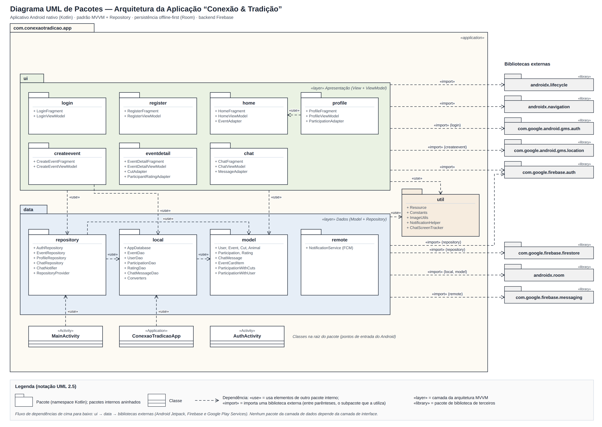
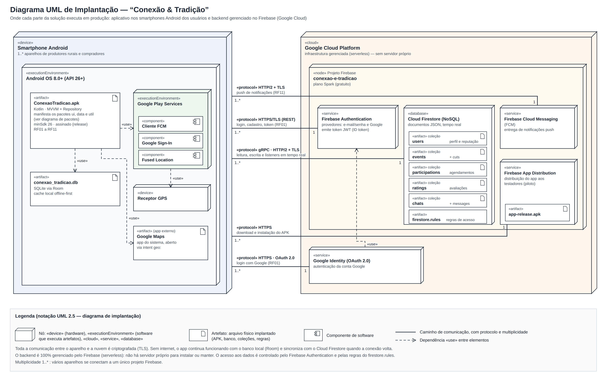
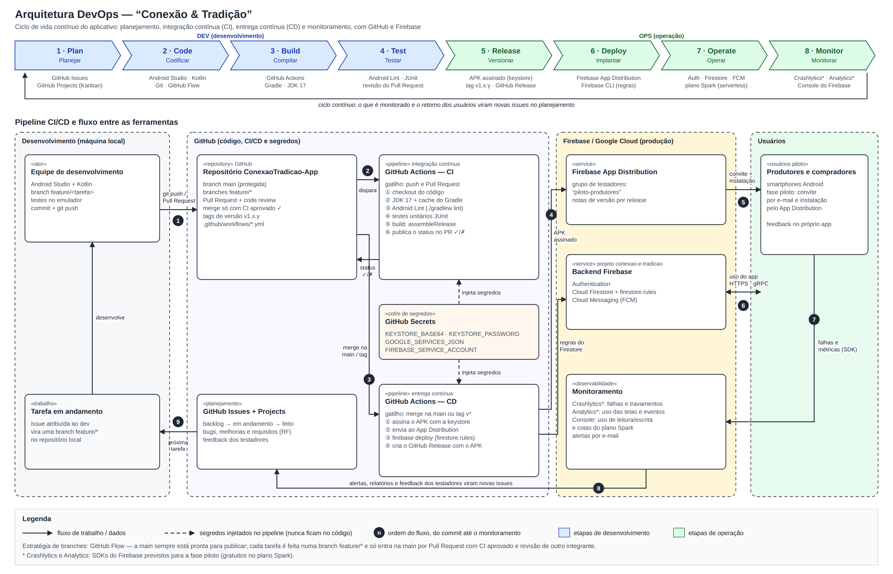

# Documentação — Prática Extensionista IV

Documentação de arquitetura do aplicativo **Conexão & Tradição**.

## 1. Diagrama UML de pacotes (arquitetura da aplicação)

O diagrama representa a organização do código-fonte do aplicativo Android em pacotes (namespaces Kotlin), com as dependências entre eles. O aplicativo segue o padrão arquitetural <strong>MVVM (Model–View–ViewModel)</strong> com a camada <strong>Repository</strong>, recomendado pelo Google para apps Android. Ele também adota a abordagem <strong>offline-first</strong>: os dados ficam salvos no aparelho (Room) e são sincronizados com a nuvem (Firebase) quando há conexão, o que atende ao público rural com sinal de internet instável.

### Pacotes da aplicação

| Pacote | Camada | Responsabilidade |
|---|---|---|
| `ui.login`, `ui.register` | Apresentação | Telas de login e cadastro (e-mail/senha e Google) — RF01 |
| `ui.home` | Apresentação | Listagem e busca dos próximos eventos de carneamento — RF03, RF04 |
| `ui.createevent` | Apresentação | Cadastro de evento pelo produtor (animal, cortes, preço/kg, localização) — RF05, RF09 |
| `ui.eventdetail` | Apresentação | Detalhes do evento, agendamento, finalização e avaliação — RF06, RF07, RF10 |
| `ui.chat` | Apresentação | Chat em tempo real entre comprador e produtor — RF08 |
| `ui.profile` | Apresentação | Perfil, reputação e histórico de participações — RF02, RF10 |
| `data.repository` | Dados | Regras de acesso a dados; decide entre o banco local e o Firebase e faz a sincronização |
| `data.local` | Dados | Banco de dados local (Room/SQLite): `AppDatabase` e DAOs |
| `data.model` | Dados | Entidades do domínio: usuário, evento, corte, participação, avaliação, mensagem |
| `data.remote` | Dados | Serviço de recebimento de notificações push (Firebase Cloud Messaging) — RF11 |
| `util` | Utilitário | Classes de apoio usadas pelas duas camadas (estado de carregamento, imagens, notificações) |
| Classes da raiz | Entrada | `ConexaoTradicaoApp` (inicializa o app), `AuthActivity` (fluxo de login) e `MainActivity` (fluxo principal) |

### Bibliotecas externas

| Pacote | Uso no projeto |
|---|---|
| `androidx.lifecycle` | ViewModel e LiveData (padrão MVVM) |
| `androidx.navigation` | Navegação entre as telas |
| `androidx.room` | Banco de dados local (offline-first) |
| `com.google.firebase.auth` | Autenticação de usuários |
| `com.google.firebase.firestore` | Banco de dados na nuvem, em tempo real |
| `com.google.firebase.messaging` | Notificações push |
| `com.google.android.gms.auth` | Login com conta Google |
| `com.google.android.gms.location` | Localização do evento (GPS) |

### Regras de dependência

As dependências seguem um único sentido, de cima para baixo: <strong>ui → data → bibliotecas externas</strong>. As telas (<code>ui</code>) acessam os dados por meio do <code>data.repository</code>. As exceções pontuais são a consulta ao usuário logado (<code>firebase.auth</code>) e a leitura do nome do produtor no cadastro de evento (<code>createevent → data.local</code>), ambas representadas no diagrama. A camada de dados, por sua vez, não depende de nenhuma classe da interface. Essa separação diminui o acoplamento, facilita os testes e permite trocar a fonte de dados (por exemplo, outro backend) sem alterar as telas. As dependências foram levantadas a partir dos <code>import</code> do código-fonte real, disponível em <a href="https://github.com/fabioccf2/ConexaoTradicao-App">github.com/fabioccf2/ConexaoTradicao-App</a>.

**Notação UML utilizada:** pacote (retângulo com aba), pacotes aninhados, classe, dependência (seta tracejada com ponta aberta) com os estereótipos `«use»` (uso de pacote interno) e `«import»` (importação de biblioteca externa), além dos estereótipos `«application»`, `«layer»` e `«library»`.

## 2. Diagrama de arquitetura de implantação

O diagrama de implantação mostra <strong>onde cada parte da solução executa em produção</strong> e como os nós se comunicam. A solução tem dois lados: o <strong>aplicativo</strong>, instalado nos smartphones Android dos usuários, e o <strong>backend</strong>, que roda inteiro em serviços gerenciados do <strong>Firebase</strong> (Google Cloud). Não existe servidor próprio para instalar, configurar ou manter: o modelo é <em>serverless</em> (sem servidor), no plano gratuito Spark.

### Nós e artefatos

| Nó | Tipo | O que executa / armazena |
|---|---|---|
| Smartphone Android | «device» | Aparelho de cada usuário (produtor rural ou comprador). Vários aparelhos (1..*) se conectam ao mesmo backend |
| Android OS 8.0+ (API 26+) | «executionEnvironment» | Sistema operacional que executa o app. A versão mínima foi escolhida para cobrir aparelhos mais simples, comuns no interior |
| `ConexaoTradicao.apk` | «artifact» | O aplicativo compilado e assinado, que contém os pacotes `ui`, `data` e `util` do diagrama de pacotes |
| `conexao_tradicao.db` | «artifact» | Banco SQLite local (Room), usado como cache offline-first |
| Google Play Services | «executionEnvironment» | Serviços do Google no aparelho: cliente de notificações (FCM), login com Google e localização (Fused Location) |
| Receptor GPS / Google Maps | «device» / «artifact» | GPS usado no cadastro do local do evento; o Google Maps é aberto para mostrar o local da carneada |
| Google Cloud Platform | «cloud» | Infraestrutura em nuvem onde fica o projeto Firebase |
| Projeto Firebase `conexao-e-tradicao` | «node» | Projeto que agrupa os serviços de backend do app |
| Firebase Authentication | «service» | Cadastro e login (e-mail/senha e Google); emite o token que identifica o usuário nas requisições |
| Cloud Firestore | «database» | Banco NoSQL em tempo real, com as coleções `users`, `events` (+ `cuts`), `participations`, `ratings` e `chats` (+ `messages`), além do arquivo de regras de acesso `firestore.rules` |
| Firebase Cloud Messaging | «service» | Entrega das notificações push |
| Firebase App Distribution | «service» | Distribui o `app-release.apk` para os testadores da fase piloto |
| Google Identity (OAuth 2.0) | «service» | Autentica a conta Google no login com Google e repassa a identidade ao Firebase Authentication |

### Caminhos de comunicação

| De → Para | Protocolo | Finalidade |
|---|---|---|
| Smartphone → Firebase Authentication | HTTPS/TLS (REST) | Login, cadastro e renovação do token (RF01) |
| Smartphone → Cloud Firestore | gRPC sobre HTTP/2 + TLS | Leitura, escrita e *listeners* em tempo real (RF02 a RF10) |
| Smartphone → Firebase Cloud Messaging | HTTP/2 + TLS (conexão persistente) | Recebimento de notificações push (RF11) |
| Smartphone → Google Identity | HTTPS com OAuth 2.0 | Login com conta Google (RF01) |
| Smartphone → Firebase App Distribution | HTTPS | Download e instalação do aplicativo |

### Características da implantação

<strong>Segurança:</strong> toda a comunicação entre o aparelho e a nuvem é criptografada com TLS. O acesso ao Firestore só é liberado para usuários autenticados, conforme as regras do <code>firestore.rules</code>. <strong>Disponibilidade e conectividade:</strong> como muitos eventos acontecem em áreas rurais com sinal fraco, o app grava os dados primeiro no banco local e sincroniza com o Firestore quando a conexão volta. Assim, o usuário consegue consultar eventos e mensagens mesmo sem internet. <strong>Escalabilidade:</strong> os serviços do Firebase escalam automaticamente conforme o número de usuários, sem nenhuma mudança na arquitetura. <strong>Custo:</strong> o plano Spark é gratuito dentro de cotas suficientes para a fase piloto do projeto.

## 3. Diagrama de arquitetura DevOps

A arquitetura DevOps define <strong>como o aplicativo evolui de forma contínua</strong>: da tarefa planejada até a nova versão instalada no celular do usuário, passando por integração contínua (CI), entrega contínua (CD) e monitoramento. As ferramentas foram escolhidas por serem <strong>gratuitas</strong>, <strong>integradas entre si</strong> e compatíveis com o que o projeto já usa: GitHub para código e automação, e Firebase para backend, distribuição e monitoramento. A parte de cima do diagrama mostra as 8 etapas do ciclo DevOps; a parte de baixo mostra o pipeline e o caminho de uma alteração, numerado de 1 a 9.

### Etapas do ciclo e ferramentas

| Etapa | Ferramentas | Como é aplicada no projeto |
|---|---|---|
| 1. Plan | GitHub Issues + GitHub Projects | Requisitos (RF), bugs e melhorias viram issues num quadro Kanban (backlog → em andamento → feito) |
| 2. Code | Android Studio, Kotlin, Git | Cada tarefa é feita numa branch `feature/*`, seguindo o GitHub Flow |
| 3. Build | GitHub Actions, Gradle (JDK 17) | A cada push ou Pull Request, o app é compilado automaticamente num servidor do GitHub |
| 4. Test | Android Lint, JUnit, revisão de PR | Análise estática, testes unitários e revisão do código por outro integrante antes do merge |
| 5. Release | Keystore, tags `v1.x.y`, GitHub Release | Cada versão gera um APK assinado e numerado com versionamento semântico |
| 6. Deploy | Firebase App Distribution, Firebase CLI | O APK é enviado aos testadores da fase piloto e as regras do Firestore são publicadas |
| 7. Operate | Firebase (Auth, Firestore, FCM) | Backend gerenciado (serverless), sem servidor para administrar |
| 8. Monitor | Firebase Crashlytics, Analytics, Console | Falhas, uso das telas e consumo das cotas do plano gratuito são acompanhados |

### Fluxo do pipeline

1. O desenvolvedor faz `git push` da branch `feature/*` e abre um **Pull Request**.
2. O PR **dispara o CI** no GitHub Actions: checkout, JDK 17 com cache do Gradle, Android Lint, testes unitários e build. O resultado (✓ ou ✗) aparece no próprio PR, e a `main` só aceita merge com o CI aprovado.
3. O **merge na `main`** (ou uma tag de versão `v*`) **dispara o CD**.
4. O CD assina o APK com a keystore guardada nos **GitHub Secrets**, envia o arquivo ao **Firebase App Distribution**, publica as regras do Firestore e cria um GitHub Release.
5. Os produtores e compradores do grupo piloto recebem o **convite por e-mail** e instalam a nova versão.
6. O app se comunica com o backend Firebase (HTTPS/gRPC), como descrito no diagrama de implantação.
7. Os SDKs de monitoramento enviam **falhas e métricas** de uso ao Firebase.
8. Alertas, relatórios e o **feedback dos testadores** viram **novas issues** no GitHub.
9. A próxima tarefa é atribuída a um desenvolvedor e o ciclo recomeça.

### Boas práticas adotadas

<strong>Segredos fora do código:</strong> a keystore de assinatura, o <code>google-services.json</code> e a credencial do Firebase ficam nos GitHub Secrets e só são injetados durante a execução do pipeline. <strong>Branch protegida:</strong> ninguém envia código direto para a <code>main</code>; tudo passa por Pull Request, CI e revisão. <strong>Rastreabilidade:</strong> cada versão distribuída tem uma tag, um GitHub Release e notas de versão, o que permite voltar a uma versão anterior se algo der errado. <strong>Feedback contínuo:</strong> o retorno dos produtores rurais na fase piloto alimenta o planejamento, mantendo o foco no problema social que o aplicativo resolve.

> **Observação:** esta é a arquitetura DevOps adotada para a continuidade do projeto na Prática Extensionista IV. Os itens marcados com * no diagrama (Crashlytics e Analytics) são SDKs gratuitos do Firebase previstos para a fase piloto.

## 4. Infraestrutura de deploy/publicação

*Em elaboração: escolha, descrição e justificativa da infraestrutura de publicação da solução.*
